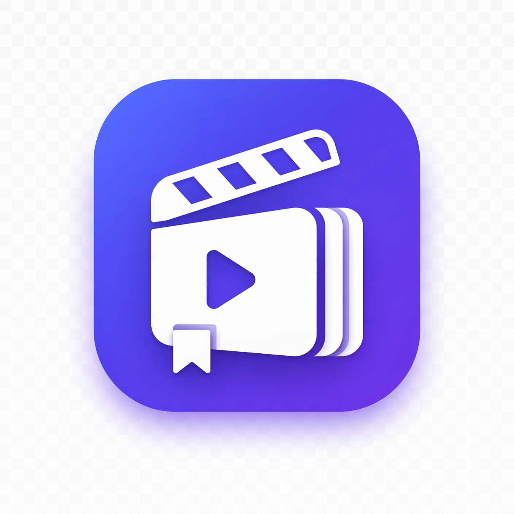

<p align="center">
  
</p>

# YouTube Video Summarizer
Build Your Personal Video Summary Library

[](https://opensource.org/licenses/MIT)

> **Version 0.3** — Actively being improved

A skill for creating structured, interactive summaries of YouTube videos with timestamps, key points, and cross-cutting themes.

**Index Page** — Your personal video library with search, filters, and quick previews:


**Summary Page** — Interactive, timestamped breakdown with themes and collapsible sections:


📁 **Try the live example:** Open [`example_output/videos/index.html`](example_output/videos/index.html) in your browser.

## 🤔 Why Use This Skill?

Compared to alternatives like **Notebook LM** or **Gemini**, this skill offers unique advantages:

| Feature | This Skill | Notebook LLM / Gemini |
|---------|-----------|----------------------|
| **Token Cost** | Uses your existing AI agent subscription | Additional tokens per video, costs add up quickly |
| **Centralized Management** | All summaries stored locally in one `videos/` folder | Dispersed across chat histories or cloud accounts |
| **Offline Access** | HTML files work without internet once generated | Requires ongoing access to the platform |
| **Data Ownership** | Your data stays on your machine | Uploaded to third-party services |
| **No Extra Sign-ups** | Works with Claude Code or Kimi Code you already have | Requires separate accounts and subscriptions |

### What Makes This Skill Special

🎨 **Polished HTML Interface** — Not just a text dump. Every summary becomes a browsable mini-app:
- **Searchable library** — find any video, topic, or tag instantly
- **Tag filters** — browse by topic with one click
- **Quick preview modal** — see themes and metadata before opening a summary
- **Collapsible sections** — scan the structure, expand what matters
- **Sidebar TOC** — jump to any section with a timestamp
- **Copy to markdown** — grab the full summary with one click
- **Responsive** — works on mobile and desktop

⚡ **No Friction** — No need to:
- Register for yet another AI product
- Upload videos to external services
- Manage API keys or pay per-use fees
- Copy-paste between different tools

🗂️ **Built for Collectors** — Designed for people who summarize videos regularly:
- Every video auto-added to your searchable local library
- Sort by date or title; filter by tag
- Share by sending the HTML files — no server needed

## Table of Contents

- [Why Use This Skill?](#-why-use-this-skill)
- [What It Does](#-what-it-does)
- [How to Use](#-how-to-use)
- [Summary Structure](#-summary-structure)
- [HTML Features](#-html-features)
- [Perfect For](#-perfect-for)
- [Directory Structure](#-directory-structure)
- [Technical Details](#-technical-details)
- [Tips for Best Results](#-tips-for-best-results)
- [Example Interaction](#-example-interaction)
- [Limitations](#-limitations)
- [Testing Status](#-testing-status)
- [Future Improvements](#-future-improvements)
- [For Developers](#-for-developers)
- [Registering as a Claude Skill](#-registering-as-a-claude-skill)
- [License](#-license)

## ✨ What It Does

This skill transforms YouTube videos into rich, structured summaries that are:

- 🎯 **Hierarchical** — Organized into sections with nested key points
- ⏱️ **Timestamped** — Every key insight linked to its moment in the video
- 🏷️ **Thematic** — Cross-cutting themes that span multiple sections
- 📱 **Interactive** — Beautiful HTML output with search, filters, and collapsible sections
- 🔗 **Indexed** — Auto-generated landing page listing all your videos

### Output Structure

```
videos/
├── index.html                    # 📑 Searchable landing page with all videos
└── video-slug/
    ├── transcript.md             # 📝 Full transcript
    ├── summary.json              # 📊 Structured summary data
    └── summary.html              # 🎨 Beautiful interactive summary
```

## 🚀 How to Use

Simply tell your AI agent:

> **"Summarize this video for me: https://www.youtube.com/watch?v=..."**

The agent will:
1. ✅ Set up the project structure (if needed)
2. ✅ Fetch the video transcript and metadata
3. ✅ Create a summary template
4. ✅ Generate a structured summary with sections and key points
5. ✅ Validate timestamps with `verify_summary.py`
6. ✅ Create an interactive HTML page
7. ✅ Update the index with your new video
8. ✅ Open the summary for you to view

### What You Get

After the agent finishes, you can:

- 📖 **Read the summary** — Open `videos/<video-slug>/summary.html`
- 🔍 **Browse all videos** — Open `videos/index.html`, search, filter, sort
- ✏️ **Edit if needed** — Modify `videos/<video-slug>/summary.json` and ask the agent to regenerate
- 📤 **Share** — Send the HTML files or host them anywhere

## 📋 Summary Structure

The generated summaries follow this hierarchy:

```
Video
├── Themes (3-5 cross-cutting ideas)
│   ├── Theme 1: Description
│   ├── Theme 2: Description
│   └── ...
│
└── Sections (6-10 major segments)
    ├── Section 1
    │   ├── Timestamp
    │   ├── Summary (2-3 sentences)
    │   └── Key Points (3-5 with timestamps)
    ├── Section 2
    └── ...
```

## 🖥️ HTML Features

### Index Page (`videos/index.html`)

Your personal video library — every summarized video in one searchable place:

- **Thumbnail cards** — YouTube thumbnail, duration badge, hover zoom
- **Card previews** — title, tags, and a one-line excerpt from the first theme
- **Metadata row** — 📋 key point count · ⏱ timestamp count · 📖 duration
- **Real-time search** — filters by title or tag as you type
- **Tag filter chips** — click any topic tag to filter; "More ▼" toggle for large collections
- **Sort dropdown** — newest first, oldest first, A-Z, Z-A
- **Quick preview modal** — click a card to see all themes and metadata before diving in
- **Action buttons** — "Read Summary" (opens full page), "▶ Watch" (YouTube), "↗ Share" (copy link)

### Summary Page (`videos/<slug>/summary.html`)

A polished, focused reading experience for a single video:

- **Branded header** — title, metadata, tags, and action buttons in one clean bar
- **Watch + Share buttons** — "🎥 Watch on YouTube" and "↗ Share" always visible
- **Themes card** — cross-cutting ideas at the top with indigo accent bars
- **Sidebar TOC** — jump to any section; active item highlighted with timestamp pill
- **Collapsible section cards** — expand what you need, collapse the rest
- **Floating copy button** — copies the full summary as markdown in one click
- **Responsive layout** — sidebar collapses cleanly on mobile

## 🎯 Perfect For

- **Research** — Academic talks, lectures, conference presentations
- **Learning** — Educational videos, tutorials, courses
- **Meetings** — Capturing key points from recorded sessions
- **Podcasts** — Long-form interviews and discussions
- **Documentation** — Creating reference materials from demos

## 📂 Directory Structure

The skill maintains this structure automatically:

```
workspace/
└── videos/
    ├── index.html              # Searchable index of all summarized videos
    ├── logo.png                # Auto-copied from artifacts/ on each update
    ├── video-1/
    │   ├── transcript.md       # Full transcript
    │   ├── summary.json        # Structured data
    │   └── summary.html        # Interactive summary
    └── video-2/
        └── ...
```

## 🛠️ Technical Details

### Dependencies

The agent automatically handles:
- `youtube-transcript-api` — Fetching transcripts
- `yt-dlp` — Video metadata

### Supported URL Formats

- `https://www.youtube.com/watch?v=VIDEO_ID`
- `https://youtu.be/VIDEO_ID`
- `https://www.youtube.com/embed/VIDEO_ID`
- `https://www.youtube.com/shorts/VIDEO_ID`
- Direct 11-character video ID

### Scripts

| Script | Purpose |
|--------|---------|
| `process_video.py` | End-to-end: fetch transcript → create template → update index |
| `generate_html.py` | Generate `summary.html` from a completed `summary.json` |
| `verify_summary.py` | Validate timestamps before generating HTML |
| `fetch_transcript.py` | Fetch transcript and metadata only |
| `init_project.py` | Initialize a new project directory |

### Requirements

- Videos must have transcripts (auto-generated works!)
- YouTube only (currently)

## 💡 Tips for Best Results

1. **Validate timestamps** — Run `verify_summary.py` before generating HTML; it catches gaps, missing coverage, and out-of-order timestamps
2. **Long videos work great** — The hierarchical structure helps navigate hours of content; aim for 8-12 sections
3. **Add tags** — 3-5 tags per video make the index filter much more useful over time
4. **Edit if needed** — The agent creates a draft; refine `summary.json` and ask the agent to regenerate HTML
5. **Educational/interview content** — Works best with clear topic shifts and substantive content

## 📝 Example Interaction

**You:**
> Summarize this video for me: https://www.youtube.com/watch?v=C0gErQtnNFE

**Agent:**
> I'll summarize that YouTube video for you. Let me start by fetching the transcript and setting up the summary structure...
> 
> ✅ Transcript fetched
> ✅ Summary template created  
> ✅ Summary completed with 12 sections and 4 themes
> ✅ Timestamps validated
> ✅ HTML generated
> ✅ Index updated
>
> **Summary complete!** The video is about Demis Hassabis and AlphaFold solving the protein folding problem. Open `videos/the-hardest-problem-ai-ever-solved-with-google/summary.html` to view.

## ⚠️ Limitations

- **YouTube only** — Currently supports YouTube URLs only
- **Transcript dependent** — Videos without transcripts (auto-generated or manual) cannot be summarized
- **English optimized** — Best results with English content; other languages may have varying quality
- **No speaker diarization** — Cannot distinguish between multiple speakers in transcripts
- **Manual review needed** — AI-generated summaries may miss nuances; always review before publishing
- **Single video at a time** — No batch processing support yet

## ✅ Testing Status

This skill has been tested with:

| Platform | Status | Notes |
|----------|--------|-------|
| **Claude Code** | ✅ Working | Primary development platform |
| **Kimi Code** | ✅ Working | Fully compatible |

Both platforms handle the skill workflow correctly: fetching transcripts, generating summaries, and creating HTML output.

## 🚀 Future Improvements

Planned enhancements for upcoming versions:

- [ ] **Batch processing** — Summarize multiple videos in one command
- [ ] **Playlist support** — Process entire YouTube playlists
- [ ] **Export formats** — PDF, Markdown, and plain text export options
- [ ] **Speaker detection** — Identify and label different speakers
- [ ] **Custom templates** — User-defined HTML/CSS themes
- [ ] **Offline mode** — Work with pre-downloaded transcripts
- [ ] **Multi-language** — Better support for non-English videos
- [ ] **Integration APIs** — Notion, Obsidian, and other note-taking tools

Have ideas? Open an issue or PR!

## 🔧 For Developers

Want to customize or extend? See `SKILL.md` for:
- Script documentation and workflow
- `summary.json` schema details
- Timestamp verification guide
- Customization options

See `youtube-summarizer/reference.md` for extended examples and tips.

## 🤖 Registering as a Claude Skill

To invoke this as a proper Claude skill (e.g. `use youtube-summarizer skill`), Claude needs to find the skill definition in its skills directory. The skill file must be registered at the **user level** AND the scripts must remain accessible from your **project root**.

### Required structure

```
~/.claude/skills/
└── youtube-summarizer/
    └── SKILL.md           ← copy of youtube-summarizer/SKILL.md

<your-project-root>/       ← Claude's working directory when invoked
├── youtube-summarizer/
│   └── scripts/           ← scripts called by SKILL.md
│       ├── process_video.py
│       ├── fetch_transcript.py
│       ├── generate_html.py
│       └── verify_summary.py
└── videos/                ← created automatically on first run
```

### Registration steps

**1. Copy the skill definition to Claude's skills directory:**

```bash
mkdir -p ~/.claude/skills/youtube-summarizer
cp youtube-summarizer/SKILL.md ~/.claude/skills/youtube-summarizer/SKILL.md
```

**2. Open Claude Code from your project root** (the directory containing `youtube-summarizer/scripts/`), then try:

> use youtube-summarizer skill — summarize https://www.youtube.com/watch?v=...

### Why this structure?

- `~/.claude/skills/youtube-summarizer/SKILL.md` — makes the skill discoverable by Claude's `Skill` tool
- Scripts stay in your project under `youtube-summarizer/scripts/` — the SKILL.md references them with paths relative to the working directory (`python3 youtube-summarizer/scripts/...`)
- `videos/` is created in the current working directory — keep Claude's working directory at the project root so outputs land in the right place

### Alternative: reference directly in conversation

If you don't want to register the skill globally, you can load it inline by tagging the file in your message:

> use @youtube-summarizer/SKILL.md — summarize https://www.youtube.com/watch?v=...

---

**Just give the agent a YouTube URL and enjoy your structured summary!** 🎉

## 📄 License

This project is licensed under the [MIT License](LICENSE) — feel free to use, modify, and distribute!
